# Agent API Testing Platform

> A comprehensive, AI-powered API testing platform with advanced GitHub repository analysis, test coverage reporting, and intelligent gap detection capabilities.

## 📋 **Table of Contents**

- [Overview](#overview)
- [Architecture](#architecture)
- [Features](#features)
- [Enhanced Coverage Analysis](#enhanced-coverage-analysis)
- [Project Structure](#project-structure)
- [Installation](#installation)
- [Running the Project](#running-the-project)
- [API Documentation](#api-documentation)
- [Frontend Components](#frontend-components)
- [Dependencies](#dependencies)
- [Usage Examples](#usage-examples)
- [Troubleshooting](#troubleshooting)

## 🎯 **Overview**

The Agent API Testing Platform is a modern, full-stack application designed to streamline API testing workflows with advanced AI-powered capabilities. It combines traditional test management with intelligent repository analysis, comprehensive test coverage reporting, and automated gap detection to help development teams build robust, well-tested APIs.

### **Key Capabilities:**
- **🔍 Advanced Repository Analysis** - Deep GitHub repository analysis with file-level insights
- **📊 Comprehensive Test Coverage Reporting** - Detailed coverage analysis for classes, methods, and files
- **🤖 AI-Powered Gap Detection** - Intelligent identification of testing gaps with prioritized recommendations
- **📄 Professional Reporting** - Downloadable Word documents with Mermaid class diagrams and coverage visualizations
- **🧠 Smart Test Generation** - AI-driven test case suggestions based on code analysis
- **🎯 Priority-Based Recommendations** - Critical, high, and medium priority suggestions for maximum impact
- **📈 Visual Coverage Diagrams** - Mermaid class diagrams with color-coded coverage indicators
- **⚡ Real-time Analysis** - Live repository scanning with progress tracking

## 🏗️ **Architecture**


### **Component Architecture:**


## ✨ **Features**

### **Core Testing Features:**
- 🧪 **Complete Test Lifecycle Management** - Create, edit, delete, and duplicate tests
- 🔄 **Batch Test Execution** - Run multiple tests simultaneously with parallel processing
- 📊 **Real-time Results** - Live execution status and detailed reporting
- 🎯 **Smart Assertions** - Multiple assertion types (status code, response time, JSON path, headers)

### **AI-Powered Capabilities:**
- 🤖 **Intelligent Test Generation** - AI suggests tests based on endpoint patterns
- 🧠 **Smart Assertion Recommendations** - Context-aware assertion suggestions
- 🔮 **Next API Call Predictions** - Suggests logical follow-up endpoint calls
- 📈 **Confidence Scoring** - AI confidence ratings for suggestions

### **Integration Features:**
- 📂 **Postman Collection Import** - Full v2.1 support with automatic conversion
- 🌐 **GitHub Repository Analysis** - Analyze repos to generate API tests
- � **Professional Reporting** - Export to Word documents with charts and analysis
- 💾 **JSON Import/Export** - Standard format for test sharing and backup

### **User Experience:**
- 🎨 **Modern Tab-based Interface** - Intuitive navigation between features
- 🔧 **In-line Test Editing** - Edit tests directly in the management interface
- ⚡ **Real-time Backend Status** - Live connection monitoring with auto-retry
- � **Responsive Design** - Works on desktop and mobile devices

## 📊 **Enhanced Coverage Analysis**

### **Repository Analysis Engine**
The platform includes a sophisticated repository analysis engine that provides deep insights into your codebase structure and test coverage.

#### **🔍 Deep Code Analysis Features:**
- **File Structure Analysis** - Comprehensive scanning of source files, test files, and configuration files
- **Class & Method Detection** - Automatic identification of classes, methods, and functions
- **Complexity Scoring** - Assigns complexity scores to identify critical areas requiring tests
- **Framework Detection** - Auto-detection of frameworks (FastAPI, Django, Flask, etc.)
- **Language Analysis** - Multi-language support with Python focus
- **Dependency Mapping** - Identifies external dependencies and their usage

#### **📈 Test Coverage Calculation:**


**Coverage Metrics:**
- **Overall Coverage Percentage** - Total test coverage across the repository
- **File-Level Coverage** - Individual file coverage with line-by-line analysis
- **Class-Level Coverage** - Coverage for each class with method breakdown
- **Method-Level Coverage** - Function coverage with test mapping
- **Complexity Impact** - Coverage weighted by code complexity

#### **🤖 AI-Powered Gap Detection:**
The platform uses advanced AI algorithms to identify testing gaps and provide intelligent recommendations:

**Gap Detection Categories:**
- **Critical Gaps** - Missing tests for core business logic (Services, Controllers)
- **High Priority Gaps** - Uncovered complex methods and API endpoints
- **Medium Priority Gaps** - Utility functions and helper methods
- **Edge Case Detection** - Identifies potential edge cases requiring tests

**AI Suggestion Types:**
- **Class Test Suggestions** - Complete test suites for uncovered classes
- **Method Test Recommendations** - Specific test cases for individual methods
- **Error Handling Tests** - Exception and error scenario testing
- **Edge Case Tests** - Boundary condition and limit testing
- **Integration Tests** - API endpoint and service integration testing

#### **📊 Visual Coverage Diagrams:**
The platform generates comprehensive Mermaid class diagrams with color-coded coverage indicators:

```mermaid
classDiagram
    class UserService {
        +coverage: 85%
        +create_user() ✓
        +update_user() ✓
        +delete_user() ✗
        +validate_email() ✓
    }
    UserService : <<good_coverage>>
    
    class AuthController {
        +coverage: 45%
        +login() ✓
        +logout() ✗
        +refresh_token() ✗
        +validate_token() ✗
    }
    AuthController : <<poor_coverage>>
    
    class DatabaseManager {
        +coverage: 92%
        +connect() ✓
        +execute_query() ✓
        +close() ✓
        +backup() ✓
    }
    DatabaseManager : <<good_coverage>>
    
    UserService --> DatabaseManager : uses
    AuthController --> UserService : depends
    
    classDef good_coverage fill:#d4edda,stroke:#155724,stroke-width:2px
    classDef poor_coverage fill:#f8d7da,stroke:#721c24,stroke-width:2px
```



**Legend:**
- 🟢 **Green** - >80% coverage (Excellent)
- 🟡 **Yellow** - 50-80% coverage (Good)
- 🔴 **Red** - <50% coverage (Needs Improvement)
- ✓ = Method has test coverage
- ✗ = Method lacks test coverage

#### **📄 Comprehensive Word Reports:**
Generated reports include:

1. **Executive Summary**
   - Overall coverage percentage
   - Critical gaps identified
   - AI recommendations count
   - Priority breakdown

2. **Repository Analysis**
   - File structure breakdown
   - Detected frameworks and patterns
   - API endpoints discovered
   - Complexity analysis

3. **Detailed Coverage Analysis**
   - File-by-file coverage breakdown
   - Class and method coverage details
   - Missing test identification
   - Priority-based gap analysis

4. **AI-Powered Recommendations**
   - Specific test case suggestions
   - Implementation priorities
   - Effort estimates
   - Impact scores

5. **Visual Diagrams**
   - Mermaid class diagrams with coverage
   - Dependency relationship maps
   - Coverage trend visualizations

6. **Improvement Strategy**
   - Step-by-step improvement plan
   - Tool recommendations
   - Best practices guidelines
   - Implementation roadmap

#### **🎯 Usage Example:**

**1. Repository Analysis:**
```bash
POST /analyze-repository
{
  "github_url": "https://github.com/user/api-project",
  "branch": "main",
  "test_description": "Comprehensive API testing analysis"
}
```

**2. Response Includes:**
```json
{
  "status": "success",
  "coverage_report_id": "uuid-12345",
  "test_coverage_analysis": {
    "overall_coverage": {
      "coverage_percentage": 72.5,
      "total_classes": 15,
      "covered_classes": 11,
      "total_methods": 45,
      "covered_methods": 33
    },
    "coverage_gaps": [
      {
        "type": "critical_classes",
        "priority": "critical",
        "items": ["AuthService", "PaymentController"]
      }
    ]
  },
  "ai_test_suggestions": {
    "total_suggestions": 12,
    "critical_suggestions": 3,
    "improvement_strategy": ["Focus on Service classes first", "..."]
  },
  "mermaid_diagram": "classDiagram...",
  "generated_tests": [...]
}
```

**3. Download Comprehensive Report:**
```bash
POST /export/coverage-report
{
  "coverage_report_id": "uuid-12345",
  "include_mermaid_diagram": true,
  "include_ai_suggestions": true
}
```

This enhanced coverage analysis transforms the platform from a simple test runner into a comprehensive code quality and testing strategy tool.

## � **Project Structure**

```
agent-api-testing-platform/
├── 📄 main_minimal_clean.py          # Main FastAPI backend server
├── 🌐 frontend_simple.html           # Complete frontend interface
├── 📋 requirements.txt               # Python dependencies
├── 📝 README.md                      # Project documentation
├── 🔧 UI_TROUBLESHOOTING.md          # Troubleshooting guide
├── 🧹 cleanup.sh                     # Cleanup script for temp files
├── 🚀 start.sh                       # Quick start script
└── ⚙️ setup.sh                       # Setup and initialization script
```

### **File Descriptions:**

| File | Description | Size | Purpose |
|------|-------------|------|---------|
| `main_minimal_clean.py` | FastAPI backend server with all endpoints | ~700 lines | Core application server |
| `frontend_simple.html` | Complete HTML/CSS/JS frontend | ~600 lines | User interface |
| `requirements.txt` | Python package dependencies | 4 packages | Dependency management |
| `UI_TROUBLESHOOTING.md` | Connection troubleshooting guide | ~100 lines | User support |
| `cleanup.sh` | Cleanup script for temporary files | ~30 lines | Maintenance |
| `start.sh` | Quick start script | ~25 lines | Convenience |

## 🛠 **Installation**

### **Prerequisites:**
- **Python 3.7+** (Tested with Python 3.13)
- **Modern Web Browser** (Chrome, Firefox, Safari, Edge)
- **Internet Connection** (for AI features and GitHub analysis)

### **Step 1: Clone/Download Project**
```bash
# If using git
git clone <repository-url>
cd agent-api-testing-platform

# Or extract from ZIP
unzip agent-api-testing-platform.zip
cd agent-api-testing-platform
```

### **Step 2: Install Dependencies**
```bash
# Install Python packages
pip install -r requirements.txt

# Or install manually
pip install fastapi==0.68.0 uvicorn==0.15.0 python-dotenv==1.0.0 typing-extensions>=3.7.4
```

### **Step 3: Make Scripts Executable (Linux/Mac)**
```bash
chmod +x cleanup.sh
chmod +x start.sh
chmod +x setup.sh
```

## 🚀 **Running the Project**

### **Method 1: Quick Start (Recommended)**
```bash
# One-command start
./start.sh
```

### **Method 2: Manual Start**
```bash
# Start backend server
python main_minimal_clean.py

# In another terminal or browser, open frontend
open frontend_simple.html
# Or double-click the HTML file
```

### **Method 3: Development Mode**
```bash
# Start with auto-reload for development
uvicorn main_minimal_clean:app --reload --host 0.0.0.0 --port 8000
```

### **Expected Output:**
```
🚀 Starting Agent API Testing Platform - COMPLETE EDITION
📡 Backend API: http://localhost:8000
📚 API Documentation: http://localhost:8000/docs
🎨 Frontend: Open frontend_simple.html in your browser

✨ ALL NEW FEATURES ENABLED:
   ✅ Test Management (Create/Edit/Delete)
   ✅ Smart Assertions Builder
   ✅ AI-Powered Suggestions
   ✅ Import/Export Tests (JSON)
   ✅ Word Document Export
   ✅ Individual Test Execution
   ✅ Batch Test Execution
   ✅ Next API Call Recommendations
   ✅ Enhanced Reporting & Analytics
   ✅ GitHub Repository Analysis
   ✅ Test Coverage Analysis
   ✅ AI-Powered Coverage Gap Detection
   ✅ Mermaid Class Diagrams with Coverage
   ✅ Comprehensive Word Reports

INFO:     Uvicorn running on http://0.0.0.0:8000 (Press CTRL+C to quit)
```

## 📚 **API Documentation**

### **Health & Status Endpoints**

#### `GET /health`
**Description:** Health check endpoint to verify server status  
**Parameters:** None  
**Response:**
```json
{
  "status": "healthy",
  "message": "Agent API Testing Platform with Complete Features",
  "python_compatible": true,
  "features": [
    "GitHub Repository Analysis",
    "AI Test Generation",
    "Test Management (CRUD)",
    "Smart Assertions",
    "Import/Export",
    "Word Document Export",
    "AI Suggestions",
    "Batch Execution"
  ]
}
```

#### `GET /`
**Description:** Root endpoint with platform information  
**Parameters:** None  
**Response:** Platform overview with available endpoints and features

### **Test Management Endpoints**

#### `GET /tests`
**Description:** Retrieve all stored tests  
**Parameters:** None  
**Response:**
```json
{
  "status": "success",
  "tests": [
    {
      "id": "uuid-string",
      "name": "Test Name",
      "method": "GET",
      "endpoint": "https://api.example.com/users",
      "headers": {"Content-Type": "application/json"},
      "body": null,
      "assertions": [
        {"type": "status_code", "expected": 200},
        {"type": "response_time", "max_ms": 2000}
      ],
      "description": "Test description",
      "created_at": "2024-01-01T12:00:00",
      "updated_at": "2024-01-01T12:00:00",
      "tags": ["api", "test"],
      "collection": "default",
      "ai_generated": false,
      "confidence": 0.5,
      "source": "manual"
    }
  ],
  "total": 1,
  "message": "All tests retrieved successfully"
}
```

#### `POST /tests`
**Description:** Create a new test  
**Parameters:**
```json
{
  "name": "string (required)",
  "method": "GET|POST|PUT|DELETE|PATCH",
  "endpoint": "string (required)",
  "headers": {"key": "value"},
  "body": "object|null",
  "assertions": [
    {"type": "status_code", "expected": 200}
  ],
  "description": "string",
  "tags": ["string"],
  "collection": "string"
}
```
**Response:** Created test object with generated ID and timestamps

#### `GET /tests/{test_id}`
**Description:** Retrieve a specific test by ID  
**Parameters:**
- `test_id` (path): UUID of the test  
**Response:** Single test object or 404 error

#### `PUT /tests/{test_id}`
**Description:** Update an existing test  
**Parameters:**
- `test_id` (path): UUID of the test
- Body: Same as POST /tests (all fields optional)  
**Response:** Updated test object

#### `DELETE /tests/{test_id}`
**Description:** Delete a test by ID  
**Parameters:**
- `test_id` (path): UUID of the test  
**Response:**
```json
{
  "status": "success",
  "message": "Test 'Test Name' deleted successfully",
  "deleted_test": {...}
}
```

### **Test Execution Endpoints**

#### `POST /execute-test/{test_id}`
**Description:** Execute a single test  
**Parameters:**
- `test_id` (path): UUID of the test  
**Response:**
```json
{
  "status": "success",
  "execution": {
    "test_id": "uuid",
    "test_name": "Test Name",
    "success": true,
    "execution_time": 0.15,
    "timestamp": "2024-01-01T12:00:00",
    "response": {
      "status_code": 200,
      "body": {"message": "Response data"},
      "headers": {"content-type": "application/json"}
    }
  }
}
```

#### `POST /execute-batch`
**Description:** Execute multiple tests in batch  
**Parameters:**
```json
{
  "test_ids": ["uuid1", "uuid2"],
  "concurrent": false
}
```
**Response:**
```json
{
  "status": "success",
  "batch_execution": {
    "summary": {
      "total_tests": 2,
      "passed": 2,
      "failed": 0,
      "execution_time": 0.3,
      "success_rate": 100.0
    },
    "results": [...],
    "executed_at": "2024-01-01T12:00:00",
    "concurrent_execution": false
  }
}
```

#### `POST /execute-tests`
**Description:** Execute generated tests from analysis  
**Parameters:**
```json
{
  "generated_tests": [...]
}
```
**Response:** Execution summary with test results

### **AI Suggestion Endpoints**

#### `POST /ai-suggestions/test`
**Description:** Get AI-generated test suggestions  
**Parameters:**
```json
{
  "endpoint": "/api/users",
  "method": "GET",
  "context": "User management API"
}
```
**Response:**
```json
{
  "status": "success",
  "suggestions": [
    {
      "name": "Test GET /api/users - Happy Path",
      "description": "Test successful GET request to /api/users",
      "method": "GET",
      "endpoint": "/api/users",
      "headers": {"Content-Type": "application/json"},
      "body": null,
      "assertions": [...],
      "priority": "high",
      "confidence": 0.9
    }
  ],
  "context": "User management API",
  "ai_confidence": 0.85,
  "total_suggestions": 1
}
```

#### `POST /ai-suggestions/assertions`
**Description:** Get AI-suggested assertions for an endpoint  
**Parameters:**
```json
{
  "endpoint": "/api/users",
  "method": "GET"
}
```
**Response:**
```json
{
  "status": "success",
  "assertion_suggestions": [
    {
      "type": "status_code",
      "description": "Verify HTTP status code",
      "config": {"expected": 200},
      "confidence": 0.95,
      "reasoning": "Standard success response"
    }
  ],
  "endpoint": "/api/users",
  "method": "GET"
}
```

#### `POST /ai-suggestions/next-calls`
**Description:** Get suggestions for next API calls  
**Parameters:**
```json
{
  "endpoint": "/api/users",
  "method": "GET",
  "response": {...}
}
```
**Response:**
```json
{
  "status": "success",
  "next_call_suggestions": [
    {
      "endpoint": "/api/users/details",
      "method": "GET",
      "description": "Get detailed information",
      "reasoning": "Common pattern to fetch details after list operation",
      "confidence": 0.8,
      "parameters": {"id": "from_previous_response"}
    }
  ],
  "based_on": {
    "endpoint": "/api/users",
    "method": "GET",
    "response_analysis": "Analyzed response patterns"
  }
}
```

### **Import/Export Endpoints**

#### `POST /import/tests`
**Description:** Import tests from JSON or Postman collections  
**Parameters:**
```json
{
  "tests": "array|object|postman_collection"
}
```
**Supported Formats:**
- JSON array of test objects
- Single test object
- Postman Collection v2.1
- Export file with nested structure

**Response:**
```json
{
  "status": "success",
  "imported_tests": 5,
  "total_tests": 10,
  "message": "Successfully imported 5 test(s)",
  "errors": ["Optional array of error messages"]
}
```

#### `POST /export/tests`
**Description:** Export tests as JSON  
**Parameters:**
```json
{
  "test_ids": ["uuid1", "uuid2"],
  "format": "standard"
}
```
**Response:**
```json
{
  "status": "success",
  "export_data": {
    "export_info": {
      "exported_at": "2024-01-01T12:00:00",
      "total_tests": 2,
      "format": "standard"
    },
    "tests": [...]
  },
  "download_filename": "api_tests_20240101_120000.json"
}
```

#### `POST /export/results/word`
**Description:** Export test results as Word document  
**Parameters:**
```json
{
  "test_ids": ["uuid1", "uuid2"],
  "include_charts": true
}
```
**Response:**
```json
{
  "status": "success",
  "document": {
    "document_id": "uuid",
    "filename": "test_results_20240101_120000.docx",
    "generated_at": "2024-01-01T12:00:00",
    "pages": 5,
    "sections": ["Executive Summary", "Test Results", "Performance Analysis", "Recommendations"],
    "charts_included": true,
    "total_tests": 2
  },
  "download_url": "/download/filename.docx",
  "format": "docx",
  "preview": "Professional test report with charts and analysis"
}
```

#### `POST /analyze-repository`
**Description:** Enhanced GitHub repository analysis with comprehensive test coverage reporting  
**Parameters:**
```json
{
  "github_url": "https://github.com/user/repo",
  "branch": "main",
  "test_description": "Optional description"
}
```
**Response:**
```json
{
  "status": "success",
  "repository": "https://github.com/user/repo",
  "branch": "main",
  "coverage_report_id": "uuid-12345",
  "repository_analysis": {
    "name": "repo-name",
    "framework": "FastAPI",
    "language": "Python",
    "total_files": 25,
    "source_files": 15,
    "test_files": 8
  },
  "test_coverage_analysis": {
    "overall_coverage": {
      "coverage_percentage": 72.5,
      "total_classes": 15,
      "covered_classes": 11,
      "total_methods": 45,
      "covered_methods": 33
    },
    "file_coverage_summary": [...],
    "coverage_gaps": [...],
    "uncovered_areas": [...]
  },
  "ai_test_suggestions": {
    "summary": {
      "total_suggestions": 12,
      "critical_suggestions": 3,
      "high_priority_suggestions": 5,
      "medium_priority_suggestions": 4
    },
    "improvement_strategy": [...],
    "recommended_tools": [...]
  },
  "generated_tests": [...],
  "mermaid_diagram": "classDiagram...",
  "detailed_analysis": {
    "endpoints_detected": [...],
    "source_files_analyzed": 15,
    "test_files_found": 8,
    "overall_coverage_score": 72.5,
    "critical_gaps": 3,
    "high_priority_gaps": 5
  }
}
```

#### `POST /export/coverage-report`
**Description:** Export comprehensive test coverage analysis report as Word document  
**Parameters:**
```json
{
  "coverage_report_id": "uuid-12345",
  "include_mermaid_diagram": true,
  "include_ai_suggestions": true
}
```
**Response:**
```json
{
  "status": "success",
  "document": {
    "document_id": "uuid",
    "filename": "coverage_analysis_repo_20240101_120000.docx",
    "generated_at": "2024-01-01T12:00:00",
    "pages": 8,
    "sections": [
      "Executive Summary",
      "Repository Analysis", 
      "Test Coverage Analysis",
      "AI-Powered Test Suggestions",
      "Test Coverage Class Diagram"
    ],
    "charts_included": true,
    "total_tests_analyzed": 25,
    "repository": "https://github.com/user/repo",
    "overall_coverage": "72.5%",
    "ai_suggestions_count": 12
  },
  "download_url": "/download/coverage/filename.docx",
  "format": "docx",
  "preview": "Comprehensive test coverage analysis report",
  "summary": {
    "repository": "https://github.com/user/repo",
    "branch": "main",
    "overall_coverage_percentage": 72.5,
    "total_files_analyzed": 15,
    "critical_gaps": 3,
    "ai_suggestions": 12,
    "mermaid_diagram_included": true
  }
}
```

#### `POST /full-analysis`
**Description:** Complete repository analysis with execution  
**Parameters:** Same as `/analyze-repository`  
**Response:**
```json
{
  "status": "success",
  "repository": "repo_url",
  "analysis": {...},
  "execution": {
    "summary": {
      "total_tests": 5,
      "passed": 5,
      "failed": 0,
      "success_rate": 100
    }
  }
}
```

### **Utility Endpoints**

#### `POST /create-sample-tests`
**Description:** Create sample tests for demonstration  
**Parameters:** None  
**Response:**
```json
{
  "status": "success",
  "message": "Created 1 sample tests",
  "created_tests": [...]
}
```

## 🎨 **Frontend Components**

### **Architecture Overview:**
The frontend is built as a Single Page Application (SPA) using vanilla HTML5, CSS3, and modern JavaScript ES6+. It provides a comprehensive interface for all platform features through a tabbed navigation system.

### **Component Structure:**


### **Key Frontend Features:**

#### **1. Tab-based Navigation System**
- **Auto-Generate Tab** - Repository analysis and automatic test generation
- **Manual Create Tab** - Custom test creation with form validation
- **Test Management Tab** - CRUD operations for test management
- **AI Suggestions Tab** - AI-powered recommendations and insights

#### **2. Smart Form Components**
- **Dynamic Assertion Builder** - Add/remove assertions with type selection
- **JSON Validators** - Real-time validation for headers and body
- **Method Selectors** - HTTP method dropdown with context awareness
- **Endpoint Input** - URL validation with protocol detection

#### **3. Real-time Features**
- **Backend Status Monitor** - Live connection status with auto-retry
- **Progress Indicators** - Loading states for async operations
- **Toast Notifications** - Success/error messages with auto-dismiss
- **Live Test Results** - Real-time execution feedback

#### **4. File Handling Components**
- **Import Dialog** - Multi-format file upload with preview
- **Export Generator** - JSON/Word document generation
- **Postman Converter** - Collection format detection and conversion
- **Drag & Drop Support** - File upload with visual feedback

#### **5. Test Management Interface**
```javascript
// Core frontend components and their responsibilities
const FrontendComponents = {
    TabManager: {
        showTab: 'Switch between application tabs',
        initializeTabs: 'Set up tab navigation and default state'
    },
    
    TestManager: {
        loadTests: 'Fetch and display all tests',
        displayTestsList: 'Render test list with actions',
        editTest: 'In-line test editing with form',
        deleteTest: 'Test deletion with confirmation',
        duplicateTest: 'Create copy of existing test'
    },
    
    FormHandlers: {
        handleManualTestSave: 'Process manual test creation',
        collectAssertions: 'Gather assertion data from form',
        parseJSON: 'Validate and parse JSON inputs',
        addAssertion: 'Dynamically add assertion fields',
        removeAssertion: 'Remove assertion from form'
    },
    
    ImportExport: {
        showImportDialog: 'File selection and upload',
        importTests: 'Process imported test data',
        exportTests: 'Generate and download test exports',
        exportWordReport: 'Create professional reports'
    },
    
    AIIntegration: {
        getTestSuggestions: 'AI test recommendations',
        getAIAssertions: 'Smart assertion suggestions',
        getNextCallSuggestions: 'API flow predictions'
    },
    
    ExecutionEngine: {
        executeTest: 'Single test execution',
        executeBatch: 'Multiple test execution',
        displayResults: 'Show execution outcomes'
    }
};
```

### **CSS Architecture:**
- **Modern CSS Grid/Flexbox** - Responsive layouts
- **CSS Variables** - Consistent theming and colors
- **Animations & Transitions** - Smooth user interactions
- **Mobile-First Design** - Responsive across devices

### **JavaScript Architecture:**
- **ES6+ Features** - Modern JavaScript with async/await
- **Modular Functions** - Organized code structure
- **Event-Driven** - Reactive UI updates
- **Error Handling** - Comprehensive error management

## 📦 **Dependencies**

### **Backend Dependencies (Python):**

| Package | Version | Purpose | Features Used |
|---------|---------|---------|---------------|
| `fastapi` | 0.68.0 | Web framework | REST APIs, automatic docs, validation |
| `uvicorn` | 0.15.0 | ASGI server | Production server, auto-reload |
| `python-dotenv` | 1.0.0 | Environment variables | Configuration management |
| `typing-extensions` | ≥3.7.4 | Type hints | Enhanced type checking |

#### **FastAPI Features Utilized:**
- **Automatic API Documentation** - Swagger UI at `/docs`
- **Request/Response Validation** - Pydantic models
- **Path Parameters** - Dynamic URL routing
- **Query Parameters** - Optional filters and parameters
- **Request Bodies** - JSON payload validation
- **HTTP Exception Handling** - Proper error responses
- **CORS Middleware** - Cross-origin resource sharing
- **Dependency Injection** - Service layer architecture

#### **Uvicorn Configuration:**
```python
uvicorn.run(
    "main_minimal_clean:app",
    host="0.0.0.0",          # Allow external connections
    port=8000,               # Standard development port
    log_level="info",        # Detailed logging
    reload=False             # Production mode (set True for dev)
)
```

### **Frontend Dependencies (Web Standards):**

| Technology | Version | Purpose | Features Used |
|------------|---------|---------|---------------|
| HTML5 | Latest | Structure | Semantic elements, forms, file API |
| CSS3 | Latest | Styling | Grid, flexbox, animations, variables |
| JavaScript | ES6+ | Functionality | Modules, async/await, fetch API |
| Web APIs | Latest | Browser features | File API, Storage API, Fetch API |

#### **Browser Compatibility:**
- **Chrome** 60+ ✅
- **Firefox** 55+ ✅  
- **Safari** 12+ ✅
- **Edge** 79+ ✅

### **External Integrations:**

| Service | Purpose | Implementation |
|---------|---------|----------------|
| GitHub API | Repository analysis | REST API calls for repo metadata |
| Postman Collections | Test import | JSON parsing and conversion |
| Word Documents | Report export | Mock implementation (extensible) |

### **Development Dependencies:**
```bash
# Optional development tools
pip install --dev pytest          # Testing framework
pip install --dev black           # Code formatting
pip install --dev flake8          # Linting
pip install --dev mypy            # Type checking
```

### **Installation Commands:**

#### **Minimal Installation:**
```bash
pip install fastapi==0.68.0 uvicorn==0.15.0 python-dotenv==1.0.0 typing-extensions>=3.7.4
```

#### **From Requirements File:**
```bash
pip install -r requirements.txt
```

#### **Development Environment:**
```bash
# Create virtual environment
python -m venv venv
source venv/bin/activate  # Linux/Mac
# or
venv\Scripts\activate     # Windows

# Install dependencies
pip install -r requirements.txt

# Optional: Install development tools
pip install pytest black flake8 mypy
```

### **System Requirements:**

#### **Minimum Requirements:**
- **Python:** 3.7+
- **RAM:** 512MB available
- **Storage:** 100MB free space
- **Network:** Internet connection for AI features

#### **Recommended Requirements:**
- **Python:** 3.9+
- **RAM:** 1GB available
- **Storage:** 500MB free space
- **Browser:** Latest version of Chrome/Firefox/Safari

## 💻 **Usage Examples**

### **1. Basic Test Creation:**
```javascript
// Create a simple GET test
const testData = {
    name: "Get Users List",
    method: "GET",
    endpoint: "https://jsonplaceholder.typicode.com/users",
    headers: {"Content-Type": "application/json"},
    assertions: [
        {"type": "status_code", "expected": 200},
        {"type": "response_time", "max_ms": 2000}
    ],
    description: "Retrieve list of all users",
    tags: ["users", "api", "get"],
    collection: "user-management"
};

// Send to backend
const response = await fetch('http://localhost:8000/tests', {
    method: 'POST',
    headers: {'Content-Type': 'application/json'},
    body: JSON.stringify(testData)
});
```

### **2. Batch Test Execution:**
```javascript
// Execute multiple tests
const batchRequest = {
    test_ids: ["test-1", "test-2", "test-3"],
    concurrent: true
};

const result = await fetch('http://localhost:8000/execute-batch', {
    method: 'POST',
    headers: {'Content-Type': 'application/json'},
    body: JSON.stringify(batchRequest)
});

const execution = await result.json();
console.log(`Success Rate: ${execution.batch_execution.summary.success_rate}%`);
```

### **3. Postman Collection Import:**
```javascript
// Import Postman collection
const postmanCollection = {
    "info": {"name": "My API Collection"},
    "item": [
        {
            "name": "Get Users",
            "request": {
                "method": "GET",
                "url": "https://api.example.com/users"
            }
        }
    ]
};

await fetch('http://localhost:8000/import/tests', {
    method: 'POST',
    headers: {'Content-Type': 'application/json'},
    body: JSON.stringify({tests: postmanCollection})
});
```

### **4. AI Test Generation:**
```javascript
// Get AI suggestions for an endpoint
const suggestions = await fetch('http://localhost:8000/ai-suggestions/test', {
    method: 'POST',
    headers: {'Content-Type': 'application/json'},
    body: JSON.stringify({
        endpoint: "/api/products",
        method: "POST",
        context: "E-commerce product management"
    })
});

const aiTests = await suggestions.json();
console.log(`Generated ${aiTests.total_suggestions} test suggestions`);
```

### **5. Enhanced Repository Analysis with Coverage:**
```javascript
// Analyze GitHub repository with comprehensive coverage analysis
const analysis = await fetch('http://localhost:8000/analyze-repository', {
    method: 'POST',
    headers: {'Content-Type': 'application/json'},
    body: JSON.stringify({
        github_url: "https://github.com/user/api-project",
        branch: "main",
        test_description: "Complete API coverage analysis"
    })
});

const result = await analysis.json();
console.log(`Coverage Analysis Complete:
- Generated ${result.generated_tests.length} tests
- Overall Coverage: ${result.test_coverage_analysis.overall_coverage.coverage_percentage}%
- Critical Gaps: ${result.detailed_analysis.critical_gaps}
- AI Suggestions: ${result.ai_test_suggestions.summary.total_suggestions}
- Coverage Report ID: ${result.coverage_report_id}`);

// Download comprehensive coverage report
const reportResponse = await fetch('http://localhost:8000/export/coverage-report', {
    method: 'POST',
    headers: {'Content-Type': 'application/json'},
    body: JSON.stringify({
        coverage_report_id: result.coverage_report_id,
        include_mermaid_diagram: true,
        include_ai_suggestions: true
    })
});

const report = await reportResponse.json();
console.log(`Coverage Report Generated: ${report.document.filename}
- Pages: ${report.document.pages}
- Sections: ${report.document.sections.join(', ')}
- Overall Coverage: ${report.summary.overall_coverage_percentage}%
- Mermaid Diagram: ${report.summary.mermaid_diagram_included ? 'Included' : 'Not included'}`);
```

## 🔧 **Troubleshooting**

### **Common Issues & Solutions:**

#### **1. Backend Connection Issues**
**Problem:** Frontend shows "❌ Disconnected"
```bash
# Solution 1: Check if backend is running
python main_minimal_clean.py

# Solution 2: Check port availability
lsof -i :8000

# Solution 3: Try different port
uvicorn main_minimal_clean:app --port 8001
```

#### **2. Import/Export Issues**
**Problem:** File import fails
```javascript
// Check file format
const validFormats = [
    'JSON array of tests',
    'Single test object', 
    'Postman Collection v2.1',
    'Platform export file'
];

// Validate JSON structure
try {
    const data = JSON.parse(fileContent);
    console.log('Valid JSON format');
} catch (error) {
    console.error('Invalid JSON:', error.message);
}
```

#### **3. CORS Errors**
**Problem:** Browser blocks requests
```bash
# Backend solution: CORS is pre-configured
# Frontend solution: Check browser console
# Try: Disable browser security (development only)
# Chrome: --disable-web-security --user-data-dir=/tmp/chrome_dev
```

#### **4. AI Features Not Working**
**Problem:** AI suggestions return errors
```bash
# Check internet connection
curl -I https://api.github.com

# Verify endpoint accessibility
curl http://localhost:8000/health

# Test AI endpoint directly
curl -X POST http://localhost:8000/ai-suggestions/test \
  -H "Content-Type: application/json" \
  -d '{"endpoint":"/test","method":"GET"}'
```

### **Debug Mode:**
```javascript
// Enable frontend debugging
const DEBUG = true;
const API_BASE = DEBUG ? 'http://localhost:8000' : 'https://your-domain.com';

// Backend debug mode
# Set environment variable
export DEBUG=True
python main_minimal_clean.py
```

### **Performance Optimization:**
```bash
# Backend optimization
pip install --upgrade fastapi uvicorn

# Frontend optimization
# Use browser dev tools to monitor:
# - Network requests
# - Memory usage  
# - JavaScript performance
```

### **Getting Help:**
1. **Check logs** - Backend terminal output
2. **Browser console** - Frontend error messages (F12)
3. **API documentation** - http://localhost:8000/docs
4. **Troubleshooting guide** - UI_TROUBLESHOOTING.md
5. **Test endpoints** - Use curl or Postman to test API

---